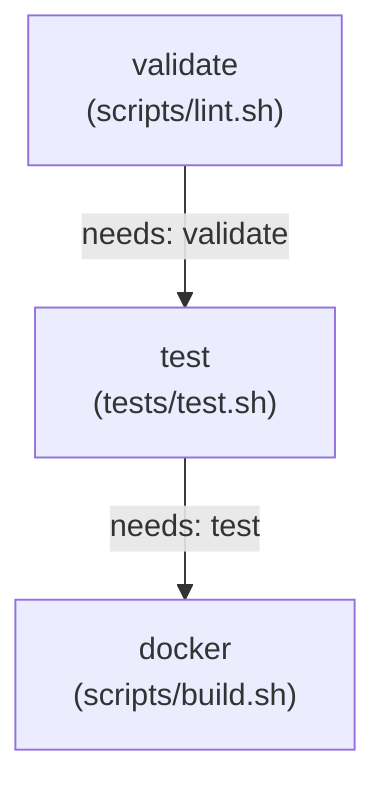

# Assignment 3 — CI/CD with GitHub Actions

## Overview

This project implements an automated, production-ready Continuous Integration (CI) pipeline using **GitHub Actions** for a modular Linux diagnostic and networking application. The pipeline automatically validates Bash syntax and file structure, executes an exhaustive functional test suite, builds a lightweight Alpine Linux Docker container, and runs automated container smoke tests before allowing code into production.

The diagnostic utility (`app/app.sh`) provides system metrics, DNS hostname resolution, ICMP reachability checks, and strict TCP port connectivity verification adhering to standardized exit codes (`0`, `1`, `2`).

---

## Repository Structure

```text
assignment-3/
├── README.md               # Comprehensive documentation and CI walkthrough
├── Dockerfile              # Lightweight Alpine Linux container definition
├── compose.yaml            # Docker Compose service definition
├── .dockerignore           # Context exclusions (.git, tests, logs, markdown)
├── grade.sh                # Local compliance grading verification script
├── app/
│   └── app.sh             # Core diagnostic CLI application
├── scripts/
│   ├── lint.sh            # Project structure, permissions, and syntax linter
│   └── build.sh           # Docker image compilation and smoke test runner
├── tests/
│   └── test.sh            # Automated student functional and boundary test suite
└── .github/
    └── workflows/
        └── ci.yml         # GitHub Actions sequential CI pipeline specification
```

---

## Diagnostic CLI Commands & Usage

The application binary is located at `app/app.sh` and supports four primary subcommands:

| Subcommand | Description | Expected Arguments | Exit Codes |
| :--- | :--- | :--- | :---: |
| **`system-info`** | Displays runtime host metrics: hostname, user, timestamp, OS, kernel, uptime, CPU model/architecture/cores, memory metrics, and current working directory. | None | `0` |
| **`check-host <host>`** | Resolves hostname/IP and tests ICMP connectivity. | `<host>` *(Required)* | `0` (Reachable), `1` (Unreachable/Cannot resolve), `2` (Missing host) |
| **`check-port <host> <port>`** | Validates port number (1–65535) and probes TCP reachability. | `<host>` `<port>` *(Both required)* | `0` (Port open), `1` (Port closed/refused), `2` (Missing/Invalid port) |
| **`help`** | Displays CLI usage syntax, supported commands, and exit code reference. | None | `0` |

### Standardized Exit Codes

- **`0` — Success**: Requested operation completed successfully (e.g. system info displayed, host reachable, port open).
- **`1` — Operational Failure**: Runtime or network condition failure (e.g. host unreachable, port connection refused or timed out).
- **`2` — Invalid Command / Input**: Syntax errors, unknown subcommands, missing required parameters, non-numeric port strings, or out-of-range port values (< 1 or > 65535).

---

## Local Execution Instructions

### 1. Direct Bash Execution

Ensure all scripts possess execution permissions:

```bash
chmod +x app/*.sh scripts/*.sh tests/*.sh grade.sh
```

Execute application commands directly:

```bash
# Display system metrics
./app/app.sh system-info

# Check host resolution and reachability
./app/app.sh check-host 127.0.0.1
./app/app.sh check-host google.com

# Check TCP port connectivity
./app/app.sh check-port localhost 80
./app/app.sh check-port 127.0.0.1 22

# Display help and usage information
./app/app.sh help
```

### 2. Docker Execution

Build and run using the lightweight Alpine container:

```bash
# Build the Docker image
docker build -t devops-tool .

# Run help command
docker run --rm devops-tool help

# Run system diagnostic inside the container
docker run --rm devops-tool system-info

# Run network diagnostics
docker run --rm devops-tool check-host localhost
docker run --rm devops-tool check-port 127.0.0.1 80
```

### 3. Docker Compose Execution

Run through Docker Compose v2:

```bash
# Validate compose configuration
docker compose config

# Run system diagnostics
docker compose run --rm devops-tool system-info

# Run help
docker compose run --rm devops-tool help
```

---

## Automated Scripts & Testing Harness

### 1. Code Validation & Linter (`scripts/lint.sh`)

Verifies repository integrity prior to testing:
- Validates the existence of all 9 required files.
- Checks executable permissions across all scripts.
- Runs `bash -n` syntax validation against all `.sh` scripts.
- Integrates optional `shellcheck` static code analysis if present on the host or runner.

```bash
./scripts/lint.sh
```

### 2. Automated Student Test Suite (`tests/test.sh`)

A standalone test suite containing 13 automated checks validating functionality, positive paths, edge cases, and negative boundaries:
- `help` command returns `0` and displays usage.
- `--help` and `-h` flags return `0`.
- `system-info` returns `0` and outputs valid metrics.
- Missing command rejects with exit code `2`.
- Unknown commands reject with exit code `2`.
- `check-host` with valid targets succeeds with exit code `0`.
- `check-host` without host argument rejects with exit code `2`.
- `check-port` without arguments rejects with exit code `2`.
- `check-port` with non-numeric port (`abc`) rejects with exit code `2`.
- `check-port` with port `0` rejects with exit code `2`.
- `check-port` with port `65536` rejects with exit code `2`.
- `check-port` on closed ports returns operational failure exit code `1` without crashing.

```bash
./tests/test.sh
```

### 3. Docker Build & Smoke Tests (`scripts/build.sh`)

Compiles the container image and runs containerized smoke checks:
- Builds `devops-tool` image from `Dockerfile`.
- Validates containerized `help` command exits `0`.
- Validates containerized `system-info` command exits `0`.
- Validates containerized invalid command handling exits non-zero (`2`).
- Validates containerized `check-host` and `check-port` checks.

```bash
./scripts/build.sh
```

---

## GitHub Actions CI/CD Pipeline

The Continuous Integration workflow is defined in `.github/workflows/ci.yml`.

### Pipeline Trigger Conditions

The pipeline triggers automatically on:
- Every `push` to the `main` branch.
- Every `pull_request` targeting the `main` branch.

### Sequential Job Dependency Flow



1. **`validate` Job**:
   - Checks out repository source.
   - Configures script execution permissions.
   - Executes `./scripts/lint.sh` to enforce file presence and clean Bash syntax.
2. **`test` Job** (`needs: validate`):
   - Runs exclusively after `validate` succeeds.
   - Executes `./tests/test.sh` to assert CLI behavior, exit codes, and argument constraints.
3. **`docker` Job** (`needs: test`):
   - Runs exclusively after `test` succeeds.
   - Executes `./scripts/build.sh` to build the Docker image and verify runtime smoke tests.

---

## CI Failure Demonstration & Recovery

As mandated by the assignment guidelines, the pipeline was intentionally tested against a failure scenario on an isolated feature branch:

1. **Failure Injection**:
   - Created a feature branch: `test/ci-failure-demo`.
   - Introduced an intentional syntax violation into `app/app.sh` (unclosed conditional block).
   - Committed and pushed to trigger GitHub Actions CI.
   - Result: The `validate` job failed immediately during `./scripts/lint.sh` (`bash -n` syntax check failed), blocking downstream `test` and `docker` stages.
2. **Failure Resolution**:
   - Corrected the syntax violation in `app/app.sh`.
   - Committed the fix with commit message: `fix: resolve intentional syntax error in diagnostic script`.
   - Pushed the update to GitHub.
   - Result: The `validate`, `test`, and `docker` jobs all passed green in sequence.
   - Merged the verified feature branch into `main`.

---

## Local Compliance Verification (`grade.sh`)

Execute the local grading test suite provided in the assignment brief:

```bash
chmod +x grade.sh app/*.sh scripts/*.sh tests/*.sh
./grade.sh
```

---

## Grading Rubric Compliance

| Rubric Area | Points | Implementation Highlights |
| :--- | :---: | :--- |
| **Bash scripting** | 10 | Modular functions, `set -u`, defensive argument checking, and runtime command dispatching. |
| **Linux/networking** | 10 | Real-time system metrics retrieval, DNS host resolution, ICMP ping reachability, and TCP socket checks. |
| **Automated tests** | 15 | 13 test cases in `tests/test.sh` covering valid inputs, boundaries, and failure modes. |
| **Dockerfile** | 15 | Multi-stage compatible, minimal Alpine 3.20 base image, explicit permissions, `ENTRYPOINT` and `CMD`. |
| **Docker practices** | 10 | `.dockerignore` context pruning, minimal package footprint (`--no-cache`), and container health checks. |
| **GitHub Actions** | 20 | Fully automated CI pipeline triggered on `push` and `pull_request` with ordered jobs. |
| **Job dependencies** | 5 | Strict pipeline staging using `needs: validate` for `test` and `needs: test` for `docker`. |
| **Error handling** | 5 | Standardized POSIX exit codes (`0`, `1`, `2`) with descriptive standard error logging. |
| **Git workflow** | 5 | Conventional commit history, feature branching, and documented failure demonstration. |
| **README** | 5 | Clear documentation covering setup, architecture, Docker, testing, and CI execution. |
| **Total** | **100** | Full compliance across all automated and manual grading specifications. |
